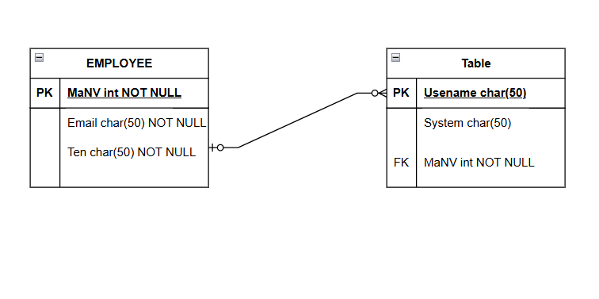
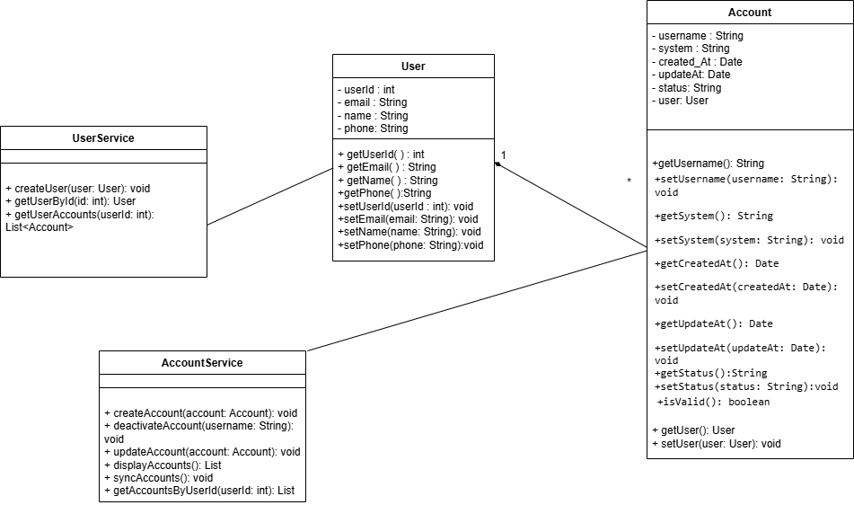
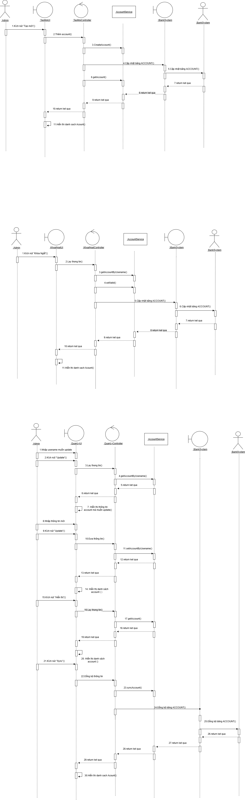

<pre> ```sql CREATE TABLE USERS ( UserId INT NOT NULL PRIMARY KEY, Email VARCHAR2(50) NOT NULL, Name VARCHAR2(50) NOT NULL, Phone VARCHAR2(50) ); CREATE TABLE ACCOUNT ( Username VARCHAR2(50) NOT NULL PRIMARY KEY, System VARCHAR2(50) NOT NULL, Create_At DATE DEFAULT SYSDATE, Update_At DATE, UserId INT NOT NULL, Status VARCHAR2(50) DEFAULT 'ACTIVE', CONSTRAINT fk_account_user FOREIGN KEY (UserId) REFERENCES USERS(UserId) ON DELETE CASCADE ); -- Xem dữ liệu SELECT * FROM USERS; SELECT * FROM ACCOUNT; ``` </pre>
<pre> ```sql 
DROP TABLE ACCOUNT;
DROP TABLE USERS;

-- Tạo bảng USER
CREATE TABLE USERS (
    UserId     INT PRIMARY KEY,
    Email      VARCHAR2(50) NOT NULL,
    Name       VARCHAR2(50) NOT NULL,
    Phone      VARCHAR2(20)
);

-- Tạo bảng ACCOUNT
CREATE TABLE ACCOUNT (
    Username    VARCHAR2(50) PRIMARY KEY,
    System      VARCHAR2(50) NOT NULL,
    Create_At   DATE DEFAULT SYSDATE,
    Update_At   DATE DEFAULT SYSDATE,
    Status      VARCHAR2(20) DEFAULT 'ACTIVE' CHECK (Status IN ('ACTIVE', 'DISABLED', 'LOCKED')),
    UserId      INT NOT NULL,
    CONSTRAINT fk_account_user FOREIGN KEY (UserId)
        REFERENCES USERS(UserId)
        ON DELETE CASCADE
);

-- Lấy toàn bộ dữ liệu
SELECT * FROM USERS;
SELECT * FROM ACCOUNT;
 ``` </pre>



